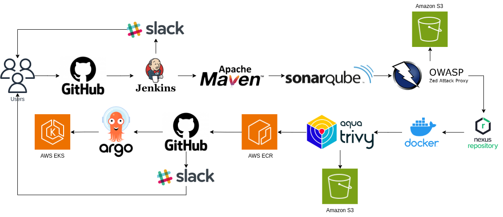

# **Jenkins DevSecOps CI/CD 파이프라인**

이 프로젝트는 Jenkins를 사용해서 DevSecOps를 구현한 CI/CD 파이프라인 입니다. 프로젝트를 위해 샘플 오픈소스 프로젝트 [spring-petclinic](https://github.com/spring-projects/spring-petclinic)을 사용했습니다.

## **파이프라인 다이어그램**


## **사전 요구사항**
다음 도구의 사전 설치 및 환경 설정이 필요합니다.
- Git (소스 관리)
- Jenkins (CI)
- Nexus (아티팩트 저장소)
- SonarQube (정적코드분석)
- Trivy (컨테이너 이미지 스캔)
- OWASP ZAP (Dependency Check)
- Docker (컨테이너 이미지 빌드 & 푸시)
- AWS S3 (취약점 스캔 결과물 업로드)
- AWS ECR (컨테이너 이미지 저장소)
- AWS EKS (쿠버네티스)
- ArgoCD (CD)
- Slack (알림)

## **환경 설정**
1. Jenkins & Jenkins Plugin 설치
2. Docker 설치
3. Trivy 설치
4. Nexus 설치
5. SonarQube 설치
6. AWS S3, ECR, EKS 생성
7. Slack 채널, APP 토큰 생성
8. Jenkins tools, Credential 설정 
9. Argo CD 설치

#### 자세한 설치 방법은 다음 저장소의 설치 가이드를 따라주세요.

https://github.com/ghkimdev/devsecops-installation

## **파이프라인 Step**
1. Slack 알림
파이프라인 시작 시 Slack 채널에 알림을 전송하여 빌드가 시작되었음을 알려줍니다.

2. Git에서 코드 체크아웃
Git에서 main 브랜치를 체크아웃하고 최신 코드를 가져옵니다.

3. 빌드 및 테스트
Maven을 사용하여 프로젝트를 빌드하고, verify 명령어로 기본적인 테스트를 실행합니다.

4. SonarQube 분석
SonarQube를 통해 코드 품질을 분석하고, 이를 통해 잠재적인 코드 품질 문제를 사전에 파악할 수 있습니다.

5. 품질 게이트
SonarQube의 품질 게이트를 통해 분석 결과가 기준을 통과할 때만 이후 단계로 진행되도록 합니다. 품질 기준을 충족하지 못하면 빌드를 중단할 수 있습니다.

6. OWASP ZAP (취약점 검사)
OWASP ZAP을 사용하여 애플리케이션의 보안 취약점을 스캔합니다. 이 과정에서 발견된 취약점은 경고로 표시되며, 이를 기반으로 후속 조치를 취할 수 있습니다. 취약점 레포트 dependency-check-report.xml는 S3에 업로드합니다.

7. Nexus에 아티팩트 업로드
빌드된 아티팩트를 Nexus 리포지토리에 업로드하여, 배포 가능한 상태로 관리합니다.

8. Docker 이미지 빌드
Docker를 사용하여 애플리케이션을 컨테이너화하고, 해당 이미지를 생성합니다. spring-boot:build-image 명령어를 통해 Spring Boot 애플리케이션을 Docker 이미지로 빌드합니다.

9. Docker 이미지 푸시
빌드된 Docker 이미지를 AWS ECR에 푸시하여, 이후 Kubernetes에서 사용할 수 있도록 합니다.

10. Trivy 이미지 보안 스캔
Trivy를 사용하여 빌드된 Docker 이미지에 대한 보안 취약점 스캔을 실행하고, 결과를 HTML 형식으로 저장하여 S3 버킷에 업로드합니다.

11. Kubernetes 배포 파일 업데이트
petclinic.yml 파일의 Docker 이미지 태그를 새로운 IMAGE_TAG로 업데이트하여 최신 이미지를 반영합니다.

12. Git에 변경 사항 푸시
업데이트된 petclinic.yml 파일을 Git에 커밋하고 푸시하여, 배포 파일을 최신 상태로 유지합니다.

13. ArgoCD 배포
ArgoCD를 사용해 AWS EKS 클러스터에 배포합니다.

## 파이프라인 코드
Jenkinsfile
```bash
pipeline {
    agent any

    tools {
        maven "maven3"
        jdk "jdk-17"
    }
    
    environment {
        RELEASE = "1.0.0"
        IMAGE_TAG = "${RELEASE}-${BUILD_NUMBER}"
        DOCKER_REGISTRY = "198669202299.dkr.ecr.ap-northeast-2.amazonaws.com"
        DOCKER_REPOSITORY = "spring-petclinic"
    }

    stages {
        stage("Slack Send Channel") {
            steps {
                script {
                    slackSend channel: 'jenkins-noti', color: 'good', message: "${env.JOB_NAME} - #${env.BUILD_NUMBER} Started by ${env.USER} (<${env.BUILD_URL}|Open>)", tokenCredentialId: 'slack-credential'
                }
            }
        }
        stage('Checkout from Git') {
            steps {
                cleanWs()
                git branch: 'main', credentialsId: 'git-credential', url: 'https://github.com/ghkimdev/spring-petclinic.git'
            }
        }
        stage('build') {
            steps {
                script {
                    withMaven(maven:'maven3') {
                        sh './mvnw -B verify'
                    }
                }
            }
        }
        stage('SonarQube analysis') {
            steps {
                script {
                    withSonarQubeEnv(credentialsId: 'sonarqube-token') {
                        withMaven(maven:'maven3') {
                            sh 'mvn sonar:sonar'
                        }
                    }
                }
            }
        }
        stage("Quality Gate") {
            steps {
                script {
                    waitForQualityGate abortPipeline: false, credentialsId: 'sonarqube-token'
                }
            }
        }
        stage("OWASP ZAP") {
            steps {
                script {
                    dependencyCheck additionalArguments: '--scan ./', odcInstallation: 'dp-check', stopBuild: false
                    dependencyCheckPublisher pattern: '**/dependency-check-report.xml'
                    withAWS(credentials: 'aws-credential', region: 'ap-northeast-2') {
                        sh 'aws s3 cp dependency-check-report.xml s3://my-jenkins-s3-bucket/${JOB_NAME}-${BUILD_NUMBER}/dependency-check-report.xml'
                    }
                    sh 'rm -f dependency-check-report.xml' 
                }
            }
        }
        stage("Nexus Artifact Upload") {
            steps {
                script {
                    nexusPublisher nexusInstanceId: 'nexus', nexusRepositoryId: 'maven-releases', packages: [[$class: 'MavenPackage', mavenAssetList: [[classifier: '', extension: '', filePath: '/var/lib/jenkins/workspace/spring-petclinic-ci/target/spring-petclinic-3.4.0-SNAPSHOT.jar']], mavenCoordinate: [artifactId: 'com.demo.spring-petclinic', groupId: 'petclinic', packaging: 'jar', version: '1.0.0']]]
                    sh 'rm -rf target/'
                }
            }
        }
        stage("Docker Build") {
            steps {
                sh './mvnw spring-boot:build-image'
            }
        }
        stage("Trivy Image Scan") {
            steps {
                sh 'trivy image ${DOCKER_REPOSITORY}:3.4.0-SNAPSHOT --format table -o trivy-image-report.html'
                withAWS(credentials: 'aws-credential', region: 'ap-northeast-2') {
                    sh 'aws s3 cp trivy-image-report.html s3://my-jenkins-s3-bucket/${JOB_NAME}-${BUILD_NUMBER}/trivy-image-report.html'
                }
                sh 'rm -f trivy-image-report.html'
            }
        }
        stage("Docker Push") {
            steps {
                script {
                    withAWS(credentials: 'aws-credential', region: 'ap-northeast-2') {
                        sh 'aws ecr get-login-password --region ap-northeast-2 | docker login --username AWS --password-stdin ${DOCKER_REGISTRY}'
                    }
                    sh 'docker tag ${DOCKER_REPOSITORY}:3.4.0-SNAPSHOT ${DOCKER_REGISTRY}/${DOCKER_REPOSITORY}:${IMAGE_TAG}'
                    sh 'docker push "${DOCKER_REGISTRY}/${DOCKER_REPOSITORY}:${IMAGE_TAG}"'
                    sh 'docker rmi "${DOCKER_REPOSITORY}:3.4.0-SNAPSHOT"'
                    sh 'docker rmi "${DOCKER_REGISTRY}/${DOCKER_REPOSITORY}:${IMAGE_TAG}"'
                }
            }
        }
        stage("Update the Deployment Tags") {
            steps {
                sh """
                   cat k8s/petclinic.yml
                   sed -i 's|${DOCKER_REPOSITORY}:.*|${DOCKER_REPOSITORY}:${IMAGE_TAG}|g' k8s/petclinic.yml
                   cat k8s/petclinic.yml
                """
            }
        }
        stage("Push the changed deployment file to Git") {
            steps {
                sh """
                    git config --global user.name "ghkimdev"
                    git config --global user.email "ghkim.dev@gmail.com"
                    git add k8s/petclinic.yml
                    git commit -m "Update petclinic.yml"
                """
                withCredentials([gitUsernamePassword(credentialsId: 'git-credential', gitToolName: 'Default')]) {
                    sh 'git push https://github.com/ghkimdev/spring-petclinic.git main'
                }
            }
        } 
    }
    post {
        success {
            slackSend channel: 'jenkins-noti', color: 'good', message: "${env.JOB_NAME} - #${env.BUILD_NUMBER} ${currentBuild.result} after ${currentBuild.durationString} sec (<${env.BUILD_URL}|Open>)", tokenCredentialId: 'slack-credential'
        }
        failure {
            slackSend channel: 'jenkins-noti', color: 'danger', message: "${env.JOB_NAME} - #${env.BUILD_NUMBER} ${currentBuild.result} after ${currentBuild.durationString} sec (<${env.BUILD_URL}|Open>)", tokenCredentialId: 'slack-credential'
        }
    }
}
```


## **참고**
https://www.practical-devsecops.com/what-is-devsecops-pipelines/

https://www.practical-devsecops.com/devsecops-best-practices/

https://medium.com/cloud-native-daily/building-a-devsecops-pipeline-with-open-source-tools-ad4fd0e13515

https://ranjaniitian.medium.com/what-is-devsecops-and-why-should-you-care-51dea54b06bf

https://www.microsoft.com/en-us/security/business/security-101/what-is-devsecops
